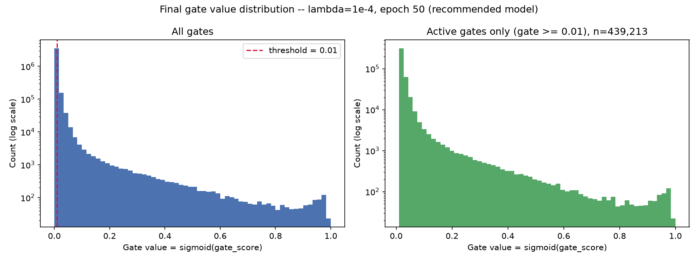
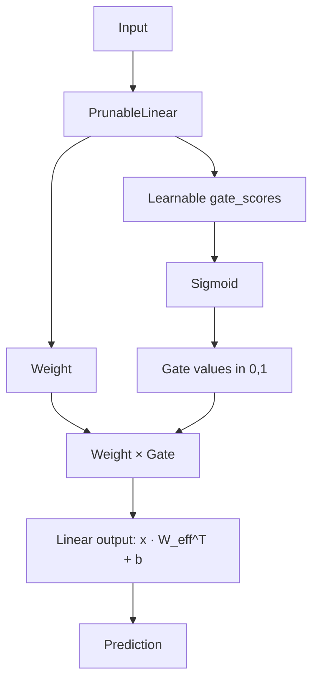

# Self-Pruning Neural Network

A learnable feed-forward neural network that discovers and suppresses unnecessary individual weight connections **during training**, using differentiable sigmoid gates and L1 sparsity regularization — no post-training pruning step.


Developed as an AI Engineering case study; the implementation and experiments stand on their own.

### Key Result

**λ = 1e-4 → 55.88% test accuracy with 88.45% gate-defined sparsity**

Sparsity is defined operationally: the percentage of gate values that fall below a threshold of `0.01`, not literal zero (gates are soft sigmoid outputs — see [How It Works](#how-it-works)).

## Results

Four primary conditions, trained under identical architecture/optimizer/seed/preprocessing for 50 epochs each:

| λ | Epochs | Test Accuracy | Sparsity |
|---:|---:|---:|---:|
| 0 | 50 | 53.12% | 0.00% |
| 1e-5 | 50 | 55.35% | 50.05% |
| **1e-4** | **50** | **55.88%** | **88.45%** |
| 1e-3 | 50 | 55.39% | 99.72% |

**λ = 1e-4 is the recommended operating point** (see "Why λ = 1e-4?" below).

Two additional lambdas were run earlier as a shorter, exploratory pilot and are **not part of the primary matched comparison** (25 epochs vs. 50 for the table above):

- λ=1e-7 → 52.77% accuracy, 0.00% sparsity (25 epochs)
- λ=1e-6 → 53.45% accuracy, 0.00% sparsity (25 epochs)

Full per-run detail (best accuracy, peak-to-final erosion, gate quantiles) is in [`report.md`](report.md).



*Final gate-value distribution for λ=1e-4. Left: all ~3.8M gates (log-scaled count), with the pruning threshold (`0.01`) marked — the large spike near zero is the pruned population. Right: zoomed on only the gates at or above threshold, showing the remaining active population is a real cluster, not noise. Gates below `0.01` are counted as pruned.*

## Why This Project?

Dense neural networks contain many connections that contribute very little to the final prediction. The conventional approach to shrinking a network is two-stage: train a dense model, then prune it afterward based on some importance criterion.

This project explores a different question: **can the network learn which of its own connections matter while it is still training**, instead of as a separate step afterward? Each weight gets a learnable gate; a sparsity penalty pushes unimportant gates toward zero during ordinary gradient descent, so pruning emerges as a side effect of training rather than a post-processing pass.

## How It Works



Each `PrunableLinear` layer owns three learnable parameter tensors — `weight`, `bias`, and `gate_scores` (same shape as `weight`) — and computes:

```
G      = sigmoid(gate_scores)      # gate values, elementwise, in (0, 1)
W_eff  = weight * G                # elementwise (Hadamard) product
y      = x · W_eff^T + bias
```

This is implemented with plain differentiable tensor ops (`sigmoid`, elementwise multiply, `F.linear`) — no custom `backward()` — so PyTorch autograd derives correct gradients for both `weight` and `gate_scores` directly.

### The sparsity objective

```
SparsityLoss = sum(G) over every PrunableLinear layer   # L1 norm, since G > 0 everywhere
TotalLoss    = CrossEntropyLoss + λ * SparsityLoss
```

- `CrossEntropyLoss` preserves classification performance.
- The L1 penalty on gate values discourages unnecessary gate magnitude — L1's constant-magnitude subgradient keeps pushing every gate toward zero at the same rate, regardless of how small it already is.
- Larger λ applies stronger downward pressure on gates; connections whose classification-loss gradient can't counteract that pressure saturate toward the low end.
- **Gate values are soft values in `(0, 1)` — they are not mathematically exact zeros.** For any finite `gate_score`, `sigmoid(gate_score) > 0` strictly.
- For evaluation, a gate is counted as **pruned** if it falls below an operational threshold of `0.01`. This distinction matters: "sparse" here means "below threshold," not "exactly zero."

## Architecture

```
CIFAR-10 image (3×32×32) → flattened to 3072
        │
PrunableLinear(3072, 1024) → ReLU
        │
PrunableLinear(1024, 512)  → ReLU
        │
PrunableLinear(512, 256)   → ReLU
        │
PrunableLinear(256, 10)
        │
   10 logits → CrossEntropyLoss
```

- Four gated linear layers, all `PrunableLinear` (including the output layer) — **not** a CNN; no BatchNorm or Dropout.
- Total gated weights across all four layers: **3,803,648** (plus an equal number of `gate_scores` and 1,802 bias terms).

## Experimental Setup

| Setting | Value |
|---|---|
| Dataset | CIFAR-10 (via `torchvision.datasets`) |
| Model | Feed-forward MLP (4 × `PrunableLinear`) |
| Optimizer | Adam, `weight_decay = 0` |
| Learning rate | `1e-3` |
| Batch size | `128` |
| Epochs (primary experiment) | `50` |
| Gate initialization | constant `+3.0` (`sigmoid(3.0) ≈ 0.953`, layers start "mostly open") |
| Sparsity threshold | `< 0.01` |
| Random seed | `42` (re-applied before building each λ's model) |
| Device | Auto-detected: CUDA > MPS > CPU |

## Results Analysis

- Weak λ values (`1e-7`, `1e-6`) produced little to no threshold-defined sparsity within their training budget.
- λ=1e-5 reached **50.05%** sparsity; λ=1e-4 reached **88.45%**; λ=1e-3 reached **99.72%**.
- Final accuracy stayed in a relatively narrow band across the four primary runs (53.12%–55.88%) — the data does **not** support a claim that higher λ always decreases accuracy.
- λ=1e-4 provides the strongest overall balance in this experiment.
- λ=1e-3 is best understood as an **aggressive stress test** rather than the recommended model: it reaches near-total sparsity but shows the largest peak-to-final accuracy erosion of any condition and a measurable (if minor) weight-gate compensation tail (see [Limitations](#limitations)).

### Why λ = 1e-4?

λ=1e-4 was selected because it combines:

- 55.88% final accuracy — the highest of all four primary conditions, including the dense baseline
- 88.45% gate-defined sparsity
- lower peak-to-final erosion (1.29 points) than the dense baseline (1.83 points)
- cleaner effective-weight behavior than λ=1e-3 — no meaningful bulk weight-gate compensation was observed, with the maximum effective weight among threshold-pruned connections remaining small

λ=1e-5 has lower peak-to-final erosion (0.83 points) than λ=1e-4, but at less than half the sparsity — see `report.md` §9 and §12 for the full trade-off discussion.

## Limitations

- Results are from a **single random seed**; no multi-seed statistical averaging was performed.
- Sigmoid gates are soft, not exact zeros — `0.01` is an operational pruning threshold, not a literal-zero check.
- Unstructured sparsity does **not** automatically produce an inference speedup: pruned weights are gated toward zero, but the underlying tensors remain dense and every forward pass still performs the full matrix multiplication.
- No physical weight removal or exported compact architecture — this is functional pruning (near-zero multiplicative gates), not structural pruning.
- λ=1e-3 shows a small weight-gate compensation tail (a minority of "pruned" connections retain a non-negligible raw weight).
- The exploratory λ=1e-7 and λ=1e-6 runs used 25 epochs, not the 50 used for the primary comparison, so they are reported separately.

Full detail and additional observations (threshold-crossing dynamics, gate-gradient behavior) are in `report.md` §11.

## Related Work

The sigmoid-gate + L1 formulation used here is directly specified by the assignment rather than adapted from a specific paper, but the design was informed by the broader literature on:

- learnable/differentiable sparsity
- L0/L1 regularization for pruning
- structured pruning approaches such as network slimming

**This project uses the assignment-specified sigmoid-gate + L1 formulation rather than reproducing any of these methods exactly.**

## Engineering Highlights

- Custom `PrunableLinear` layer implemented with plain autograd (no custom backward pass)
- 10-test unit suite covering shapes, gate range, forward correctness against a hand-computed example, and gradient-flow validation
- Deterministic, seeded, device-auto-detected experiments
- Automatic checkpointing (both final-epoch and best-observed-accuracy state per run)
- Per-epoch CSV logging (losses, accuracy, sparsity, full gate-quantile breakdown)
- Diagnostic plotting (training curves, final gate distribution)
- CLI-configurable experiment runner (`argparse`: epochs, lambdas, seed, output prefix, checkpoint directory)

## Project Structure

```
self-pruning-neural-network/
├── self_pruning_nn.py      # PrunableLinear, network, training/eval loop, CLI
├── test_prunable_linear.py # 10-test unit suite
├── requirements.txt
├── README.md
├── report.md                # full methodology, results, and analysis
├── .gitignore
└── results/
    ├── *.csv                # per-epoch logs, results tables, gate summaries
    ├── *.log                # console output from each experiment run
    └── *.png                # diagnostic plots + final gate-distribution plot
```

`data/` (CIFAR-10 cache) and `results/checkpoints*/` (trained model weights) are intentionally excluded from version control — see [Reproducibility](#reproducibility).

## Quick Start

Tested with **Python 3.14.3**; `requirements.txt` pins floor versions (`>=`) and was verified against torch `2.13.0`, torchvision `0.28.0`, numpy `2.5.2`, matplotlib `3.11.1`. Any Python >= 3.10 with these packages should work. All commands below are run from the repository root.

```bash
python3 -m venv .venv
source .venv/bin/activate
pip install -r requirements.txt
```

```bash
python test_prunable_linear.py
```
Expected result: **10/10 tests passed**.

The included results in `results/` were already produced by the completed experiment — running the tests above is enough to verify the implementation. To reproduce the full experiment from scratch:

```bash
python self_pruning_nn.py --mode full --epochs 50 --lambdas 0 1e-5 1e-4 1e-3 \
    --output-prefix primary --checkpoint-subdir checkpoints_primary --diagnostic-plots
```

This command **retrains the four primary experiments from scratch** — CIFAR-10 downloads automatically on first run (~170MB), and training takes roughly 18 minutes on the reference machine (Apple Silicon, MPS backend; CPU-only machines will be slower).

| Flag | Default | Purpose |
|---|---|---|
| `--mode` | `pilot` | `pilot` (short sanity run) or `full` (a real experiment). There is no separate `test` mode — unit tests are run directly via `python test_prunable_linear.py`. |
| `--epochs N` | 25 (full) / 5 (pilot) | Epochs per λ. The primary experiment used `--epochs 50`. |
| `--lambdas ...` | `0 1e-7 1e-6 1e-5 1e-4` | Space-separated λ grid. The primary experiment used `0 1e-5 1e-4 1e-3`. |
| `--seed N` | 42 | Re-applied before building each λ's model. |
| `--output-prefix NAME` | `full` | Filename prefix for this run's outputs, so separate experiments don't overwrite each other. |
| `--checkpoint-subdir NAME` | `checkpoints` | Subdirectory under `results/` for this run's checkpoints. |
| `--diagnostic-plots` | off | Save sparsity/accuracy/mean-gate-vs-epoch line plots after training. |

## Reproducibility

- All RNGs (`random`, `numpy`, `torch`, `torch.cuda`) are seeded via a single `set_seed()` call, re-applied before building each λ's model.
- CIFAR-10 is downloaded automatically through `torchvision.datasets.CIFAR10` on first run and cached locally.
- The results, logs, and plots in `results/` are the completed experiment's saved output, included in this repository.
- Model checkpoints are intentionally excluded from Git (large binary artifacts) — the full experiment command above regenerates them locally.
- Re-running the full experiment command reproduces the primary results; exact bit-for-bit reproduction across different hardware, OS, or library versions is not guaranteed, only a fixed seed and identical initialization/data-order within a given environment.

## Outputs

Result files actually present in `results/`:

```
results/
├── results_table.csv                          # Lambda / Test Accuracy / Sparsity (primary run)
├── final_gate_summary.csv                      # per-λ gate quantile breakdown (primary run)
├── full_epoch_logs.csv                         # per-epoch logs (primary run)
├── baseline50_epoch_logs.csv / *_results_table.csv / *_gate_summary.csv
├── extended_epoch_logs.csv / *_results_table.csv / *_gate_summary.csv
├── extended_diagnostic_{sparsity,accuracy,mean_gate}_vs_epoch.png
└── gate_distribution_lambda_1e-4.png           # final report plot
```

See `report.md` for the full methodology, mathematical formulation, complete results tables, accuracy-vs-sparsity analysis, and limitations.
